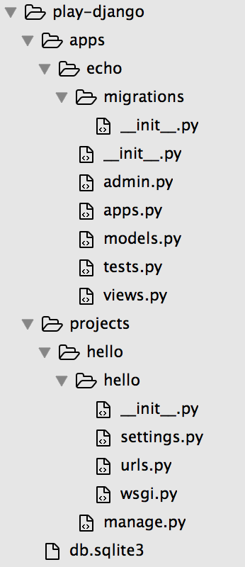
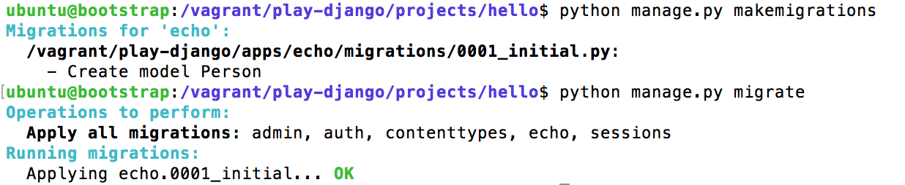
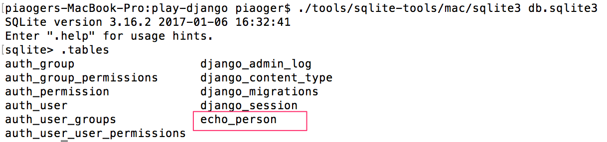
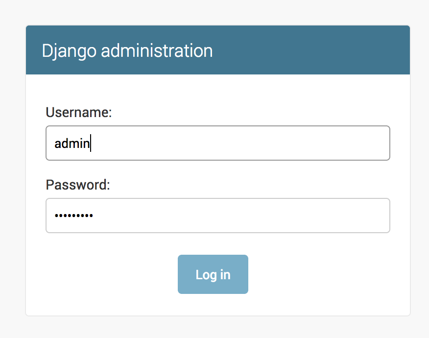
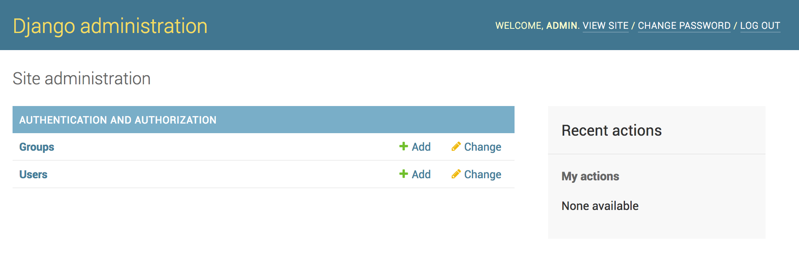
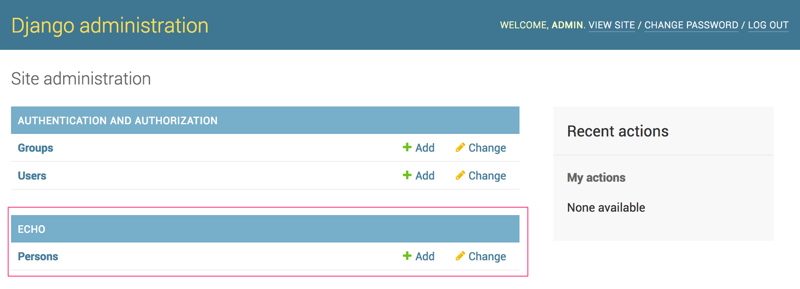
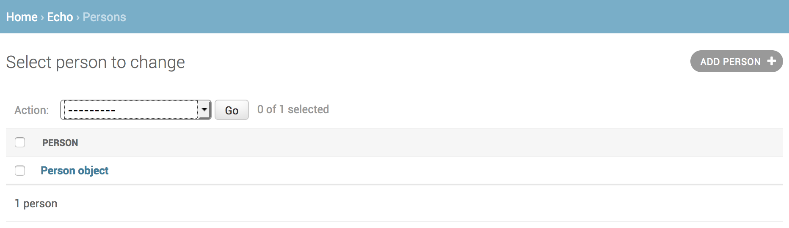
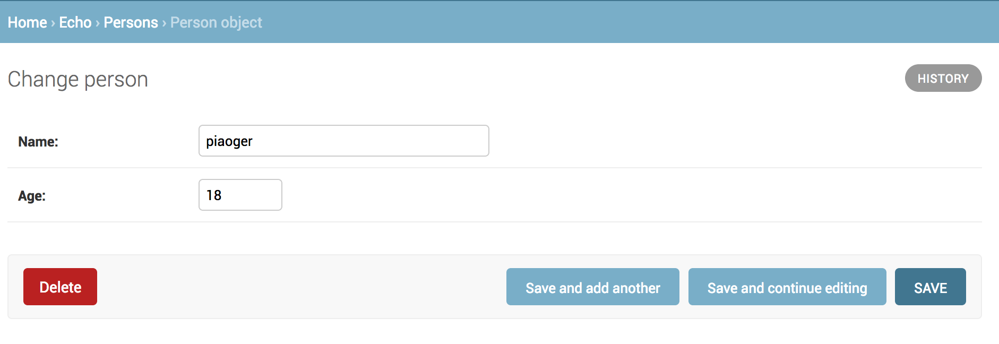

# pjango


# Python Django Web Framework

## install python & pjango

```
sudo apt-get install python-pip python-dev virtualenv -y
sudo pip install Django

```

### check your installation 

``` python
import django
django.get_version()
```

### django admin tool 

安装完Django之后，就已经有了可用的管理工具django-admin.py。我们可以使用django来创建project，app等。

django-admin.py startproject <project-name>
django-admin.py startapp <app-name>


## create play-django

``` shell
mkdir -p play-django/{projects,apps}

cd play-django/projects
django-admin.py startproject hello

cd ../apps
django-admin.py startapp echo
```

- django skeleton (projects/apps)



- add location of apps in project settings.py

``` python
# location of apps
sys.path.append(os.path.join(BASE_DIR, 'apps'))
```


## create models

django 模型与数据库息息相关，与数据库相关的代码一般写在 models.py 中。

Django 支持 sqlite3, MySQL和PostgreSQL等数据库，只需要在settings.py中配置即可，不用更改models.py中的代码，丰富的API极大的方便了使用。默认的数据库是sqlite。

- settings.py 

```
  # Database
  # https://docs.djangoproject.com/en/1.10/ref/settings/#databases
  DATABASES = {
      'default': {
          'ENGINE': 'django.db.backends.sqlite3',
          'NAME': os.path.join(BASE_DIR, 'db.sqlite3'),
      }
  }
```

  ​


- Add models for echo app:

```
class Person(models.Model):
    name = models.CharField(max_length=30)
    age = models.IntegerField()
```


- Run make migrations & migrate

  ```shell
  $ python manage.py makemigrations
  $ python manage.py migrate
  ```

  ​




- sqlite database after creating model:

You can download sqlite tool from: http://www.sqlite.org/2017/sqlite-tools-linux-x86-3160200.zip

 




## edit/query models


- create/query from djangl shell

  ```
  $ python manage.py shell
   >>> from people.models import Person
   >>> # Create new object to model
   >>> Person.objects.create(name="piaoger", age=18)
   <Person: Person object>
   >>> # query object from model
   >>> person = Person.objects.get(name="piaoger")
  <Person: Person object>
  >>> person.name
  u'piaoger'
  >>> person.age
  18
  ```

  ​

- what in sqlite after creating object in models

  通过sqlite tool我们可以发现，刚才在Person model中创建的object已经写入到数据库。

  ```
  sqlite> SELECT * FROM echo_person;
  1|piaoger|18
  ```

- create/query by coding
```
# codeing
```


- migrations文件

  file:  ./apps/echo/migrations/0001_initial.py

```python
class Migration(migrations.Migration):
    initial = True
    dependencies = [
    ]
    operations = [
        migrations.CreateModel(
            name='Person',
            fields=[
                ('id', models.AutoField(auto_created=True, primary_key=True, serialize=False, verbose_name='ID')),
                ('name', models.CharField(max_length=30)),
                ('age', models.IntegerField()),
            ],
        ),
    ]
```

- You can also change models in administration page.

  For more details, please see **Admin Page in Django*

## urlpatterns

Django 1.10 no longer allows you to specify views as a string (e.g. `'myapp.views.home'`) in your URL patterns.


```
urlpatterns = [
    url(r'^admin/', include(admin.site.urls)),
    url(r'^hello','learn.views.hello',name='hello'),
]
```

Reference: 

[url dispatcher](https://docs.djangoproject.com/en/1.10/topics/http/urls/)


## Admin page in Django

- Create superuser

  ```shell
  # create user: admin/admin1234
  python manage.py createsuperuser
  ```

- adminstration page





- Admin app is ON by default.

```python
# setting.py
INSTALLED_APPS = [
    'django.contrib.admin',
]

# urls.py
urlpatterns = [
	# Uncomment the next line to enable the admin:
    url(r'^admin/', admin.site.urls),
]
```


- change password with manage.py shell

```shell
$Python manage.py shell
>>> from django.contrib.auth.models import User 
>>> user = User.objects.get(username='admin')
>>> user.password
>>> u'pbkdf2_sha256$30000$3SPLthkVV7Fm$WB1Hj1Mv6pewiQvN6XfK9TCC52rQ+61HzT2ImZ0hn0M='
>>> user.set_password('new_password')
>>> user.save()
```


- Register and Edit model Object in Administration page

  You need to register model in app's admin.py

```
# ./apps/echo/admin.py
# Register your models here.
from .models import Person
admin.site.register(Person)
```

After that, you can find that there are some thing new in administration page:







## Django projects v.s apps

 Django中project和APP的区别: project包含全局配置，构成一个全局的运行平台；而各个APP都运行在这个全局的运行平台上，APP代表的是一个相对独立的功能模块，因为程序的逻辑都在APP中。

## Python manage.py makemigrations & migrate

老版本的django使用syncdb，而新版的已经开始使用makemigrations & migrate 

Python manage.py syncdb 会为该project内的所有app进行数据库初始化，创建表结构，初始化数据，创建索引等。若有app改变了数据库结构，或者是有新的app增加进来，要创建新的表结构，再次运行syncdb，会为这些app进行数据库变更。django怎么识别哪个app是关联了数据库的？要知道自定义的model都是继承自django.db.models.Model这个类的。

当需要命令行操作数据库时，切换数据库账号为开发者账号，支持数据库表结构变更


## issues

### Vagrant: Empty reply from server

In virtual machine: 

```
$python manage.py runserver &
$curl http://127.0.0.1:8000/hello
$echo
```

Empty response while calling from host in browser or curl:

```
$curl http://127.0.0.1:8031/hello
$curl: (52) Empty reply from server
```

How to resolve

```
$
$python manage.py runserver 0.0.0.0:8000&
```


## references

[django models例子](http://www.ziqiangxuetang.com/django/django-models.html)

[django连接mysql数据库](http://www.nowamagic.net/academy/detail/1318508)

[awesome django](https://gitlab.com/rosarior/awesome-django)